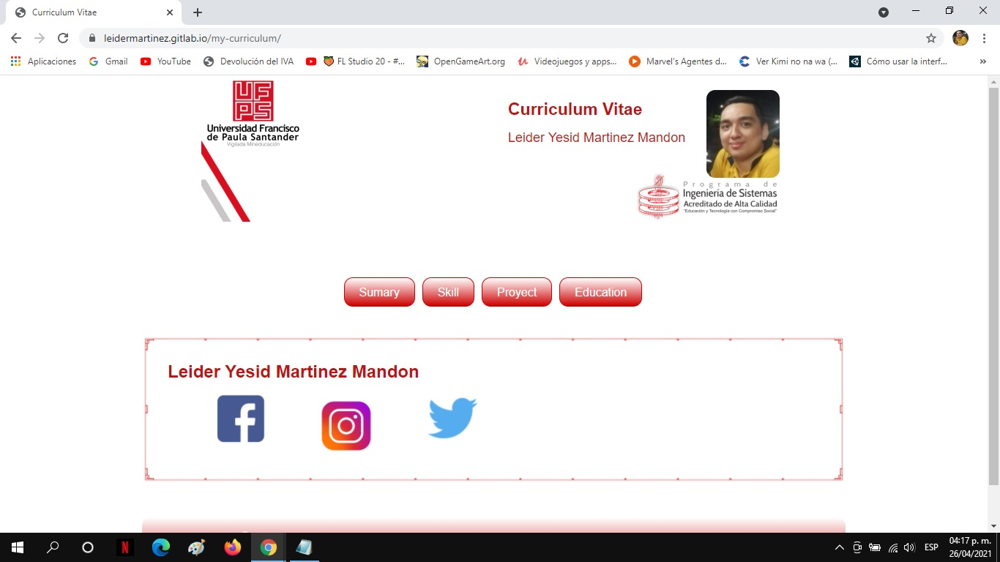

# Título del proyecto:

#### Curruculum Vitae 

## Índice
1. 📋[Características](#características)
2. 📝[Contenido del proyecto](#contenido-del-proyecto)
3. 💻[Tecnologías](#tecnologías)
4. 📲[IDE](#ide)
5. 📥[Instalación](#instalación)
6. 🖥[Demo](#demo)
7. 👫[Autor(es)](#autores)
8. 🏫[Institución Académica](#institución-académica)
9. 📚[Referencias](#referencias)

#### Características:
___
  - Uso de CSS recomendado: [ver](https://gitlab.com/leiderMartinez/my-curriculum/-/tree/master/css)
  - Basado en el mockup: [ver](https://www.dropbox.com/s/s8u22zgwl1ipacn/Actividad%20Hoja%20de%20Vida-ufps-CSS.pdf?dl=0)

  #### Contenido del proyecto
  ___
  | Ruta del archivo | Descripción |
  | --- | --- | 
  | [index.html](https://gitlab.com/leiderMartinez/my-curriculum/-/blob/master/index.html) | Archivo donde se carga la pagina principal. |
  | [html/summary.html](https://gitlab.com/leiderMartinez/my-curriculum/-/blob/master/html/summary.html) | Archivo en el cual se encuentra el resumen de todo el curriculum vitae. |
  | [html/skill_personal.html](https://gitlab.com/leiderMartinez/my-curriculum/-/blob/master/html/skill_personal.html) | Archivo en el cual se muestran las habilidades personales. |
  | [html/skill_academic.html](https://gitlab.com/leiderMartinez/my-curriculum/-/blob/master/html/skill_academic.html) | Archivo en el cual se muestran las habilidades academicas.
  | [html/projects.html](https://gitlab.com/leiderMartinez/my-curriculum/-/blob/master/html/projects.html) | Archivo en el cual se muestran los proyectos realizados en distintas areas y una descripcion breve de ellos. |
  | [html/education.html](https://gitlab.com/leiderMartinez/my-curriculum/-/blob/master/html/education.html) | Archivo en el cual se muestran los estudios cursados. |

#### Tecnologías
___

  - 
  El HTML es un lenguaje de marcación de elementos para la creación de documentos hipertexto, muy fácil de aprender, lo que permite que cualquier persona, aunque no haya programado en la vida, pueda enfrentarse a la tarea de crear una web. El elemento principal de HTML5 son las etiquetas, que también estaban en la versión anterior, pero facilita a los navegadores la interpretación de código mediante la inserción de elementos como los vídeos, que desde que se implementó los usuarios ya no tienen que descargarse herramientas adicionales para poder visualizarlos.

Otro de los elementos incorporados a HTML5 son las APIs (Application Programming Interfaces o Interfaz de programación de aplicaciones) que permiten incluir, a través de JavaScript (Lenguaje de programación) componentes complejos como juegos o  mapas de geolocalización, entre otros. También permite trabajar sin conectividad, ya que permite almacenar datos localmente para trabajar sin conexión de forma eficiente. Además de todo lo anterior HTML5 favorece al SEO (Posicionamiento orgánico) porque ayuda a los motores de búsqueda a entender mejor el contenido de la web mediante sus etiquetas categorizadas.

  - 

Usted puede ver el siguiente marco conceptual y aprender sobre HTML5:
  - [Guia completa de HTML5](https://www.w3schools.com/html/default.asp)

Usted puede ver el siguiente marco conceptual y aprender sobre CSS:
  - [Guia completa de CSS](https://www.w3schools.com/css/default.asp)

 
#### IDE
___
El proyecto se desarrolla usando Sublime Text 3 - [Descargar](https://www.sublimetext.com/3)

  Sublime Text es un editor de Texto para escribir código en casi cualquier formato de archivo. Está especialmente pensado para escribir sin distracciones. Esto quiere decir que visualmente ofrece un entorno oscuro donde las líneas de código que escribas resaltarán para que puedas centrarte exclusivamente en ellas.
 
  Ventajas de Sublime Text:
 * Muy liviano, fácil de instalar y tiene una versión portable.
 * Resalta todo tipo de lenguaje con colores para visualmente detectar fallos a simple vista.
 * Para aprender es una buena opción, porque te ayuda pero no te lo da todo hecho.
 * Funciona tanto en Windows como en Mac y Linux.

### Instalación
___

1. Local
  - Descargar el repositorio ubicado en - [descargar](http://gitlab.com/leiderMartinez/my-curriculum)
  - Invocar oágina index.html desde el navegador predeterminado.
2. Gitlab
  - Realizar un "fork" del repositorio ubicado en - [ir](http://gitlab.com/leiderMartinez/my-curriculum)
  - Crear templates de html.
  - Realizar un "commit" para guardar los cambios efectuados.
  - Dar clic a "create merge request" y a continuación dar clic en "merge".
  - Dirigirse a la sección "setting pages" para obtener el enlace del hosting.

### Demo
___
El proyecto se desplego en el sitio web gitlab.com y para ver el demo de la aplicación puede dirigirse a: [Curriculum vitae](http://leidermartinez.gitlab.io/my-curriculum/).

### Autor(es)
___
Proyecto desarrollado por: 
- Leider Yesid Martinez Mandon (<leideryesidmm@ufps.edu.co>)
- Matilde Alexandra Arévalo Leon (<matildealexandraal@ufps.edu.co>).

### Institución Académica   
___
Proyecto desarrollado en la Materia programación web del  [Programa de Ingeniería de Sistemas] de la [Universidad Francisco de Paula Santander]

### Referencias 
___
https://www.qualitydevs.com/2020/11/09/que-es-html5/

[Programa de Ingeniería de Sistemas]: <https://ww2.ufps.edu.co)>
[Universidad Francisco de Paula Santander]: <https://ingsistemas.cloud.ufps.edu.co/>
